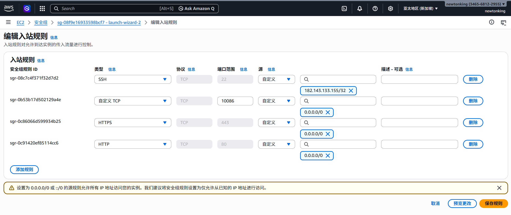

--- 
title: "自建节点宝宝级教程" 
description: "利用 AWS VPS 与 sing-box 搭建你的私人专属网络通道"
date: 2026-03-24T17:30:00+09:00 
draft: false
tags: ["VPS", "自建服务", "Sing-box"]

---
# 前置
* **VPS**: AWS 免费小鸡
* sing-box
* Ubuntu 24.04.4
### 添加入站规则
添加一个端口，接收TCP，如 10086 端口。
# 基础：朴素 sing-box + clash verge
所谓朴素 sing-box 就是 `客户端 -> 服务器10086端口 -> sing-box 服务`，入站类型采用`shadowsocks`，方法使用`aes-128-gcm`。
### 安装 sing-box
在服务器执行：
```Bash
bash <(curl -fsSL https://sing-box.app/install.sh)
```
这个是官方脚本，相对安全。

完成后用
```Bash
sing-box version
```
来验证

---

### 创建配置文件
在服务器执行：
```bash
sudo mkdir -p /etc/sing-box
```
* `-p` 递归创建，如果目录不存在，创建；如果已经存在，不报错
* `/etc` 专门放配置文件的地方，例如
	* `/etc/nginx` nginx 配置文件目录
	* `/etc/ssh` ssh 配置文件目录
* 后续我们使用`systemctl`命令默认就会在`etc`里面找要用的文件

编辑配置：
```bash
sudo nano /etc/sing-box/config.json
```
**编写最简单配置（Shadowsocks）**
其实前面下官方脚本的时候就有了这个文件，我们修改一下，把它变得简单一点。
```json
{
  "log": {
    "level": "info"
  },
  "inbounds": [
    {
      "type": "shadowsocks",
      "listen": "::",
      "listen_port": 10086,
      "network": "tcp",
      "method": "aes-128-gcm",
      "password": "5V8zJDbDQsRveXVh+2JEJA==",
      "multiplex": {
        "enabled": true,
        "padding": true
      }
    }
  ],
  "outbounds": [
    {
      "type": "direct"
    }
  ]
}
```
### 启动服务
```bash
sudo systemctl start sing-box
```
开机自启（可选）：
```bash
sudo systemctl enable sing-box
```
**检查是否成功**：
```bash
sudo systemctl status sing-box
```
### 客户端配置
客户端，指的就是你平时用的的设备：你的电脑，手机···为了访问到服务器（这个梯子）的服务所需的软件。这里我们用：
* Windows: Clash Verge
* 安卓：Clash Meta

### BBR
是一种 **TCP** 拥塞控制算法，它能：
* 根据带宽和延迟智能调速
* 不容易降速
所以**更快，更稳定**。

**检查有没有使用 BBR**
```bash
sysctl net.ipv4.tcp_congestion_control
```
输出：
* `bbr`√
* `cubic` ×

**若没有，开启 BBR**
在配置文件`/etc/sysctl.conf`的最后添加这两行：
```bash
net.core.default_qdisc=fq
net.ipv4.tcp_congestion_control=bbr
```

**让配置生效**
```bash
sudo sysctl -p
```
# 小升级：双协议方案
|      协议       | 用途     |
| :-----------: | ------ |
| Reality（无证书版） | 隐蔽 TCP |
|      UDP      | 加速     |
## Reality 无证书版
协议：shadowsockets -> vless
### 修改 sing-box 配置文件
```bash
sudo nano /etc/sing-box/config.json 
```
大改内容，因为协议所需要的字段不同
```json
{
  "log": {
    "level": "info"
  },
  "inbounds": [
    {
      "type": "vless",
      "listen": "::",
      "listen_port": 8443, # 推荐 8443，避免端口冲突
      "users": [
        {
          "uuid": "你的uuid",
          "flow": "xtls-rprx-vision"
        }
      ],
     "tls":{
        "enabled": true,
        "server_name": "www.cloudflare.com",
        "reality": {
          "enabled": true,
          "handshake": {
            "server": "www.cloudflare.com",
            "server_port": 443
          },
          "private_key": "你的私钥",
          "short_id": [
            "你的short_id"
          ]
        }
      }
    }
  ],
  "outbounds": [
    {
      "type": "direct"
    }
  ]
}
```