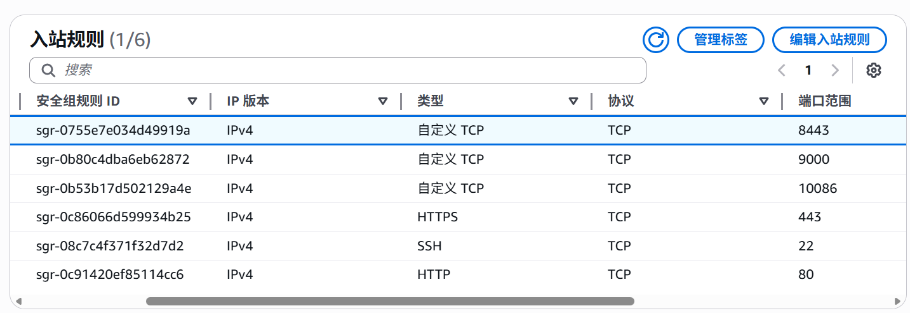
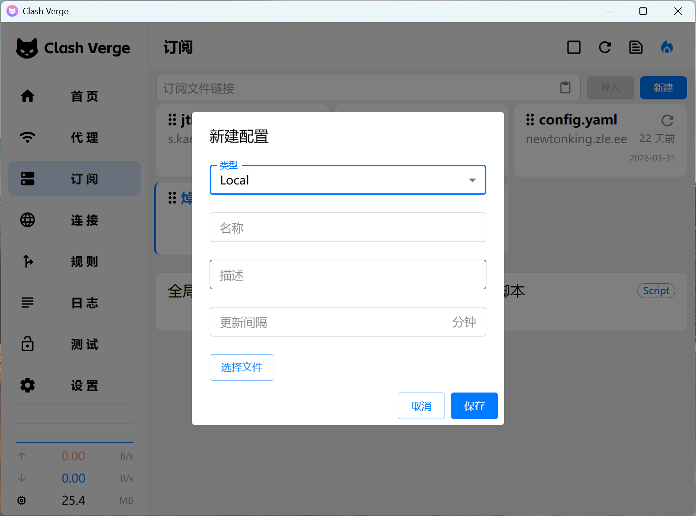

--- 
title: "自建节点宝宝教程" 
description: "利用 AWS VPS 与 sing-box 搭建你的私人专属网络通道"
date: 2026-03-24T17:30:00+09:00 
draft: false
tags: ["VPS", "自建服务", "Sing-box"]

---
# 前置
* **VPS**: AWS免费服务器。各种海外服务器都可以，这里以AWS免费用户可以开到的EC2为例。
* Sing-box: 一个开源的、轻量的代理平台，支持的代理协议全面。
* Ubuntu 24.04.4: 本教程服务器用的系统。
* 代理方案：**Vless + Reality + Vision**，基于 Xray-core 的 VLESS 协议，并配合 Reality 传输安全层与 Vision 流控特性的组合方案。

### 添加入站规则
确保你的8443端口是开着的。
以AWS为例，在`安全组`中添加入站规则，如图：

# 步骤

### 安装 sing-box
在服务器执行：
```Bash
bash <(curl -fsSL https://sing-box.app/install.sh)
```
运行`sing-box`官方下载脚本。

完成后用
```Bash
sing-box version
```
来验证

---

### 创建配置文件
在服务器执行：
```bash
sudo mkdir -p /etc/sing-box
```
* `-p` 递归创建，如果目录不存在，创建；如果已经存在，不报错
* `/etc` 专门放配置文件的地方，例如
    * `/etc/nginx` nginx 配置文件目录
    * `/etc/ssh` ssh 配置文件目录
* 后续我们使用`systemctl`命令默认就会在`etc`里面找要用的文件

**编辑配置**：
```bash
sudo nano /etc/sing-box/config.json
```
其实前面下载官方脚本后就有了这个文件，把它改成：
```json
{
  "log": {
    "level": "warn"
  },
  "inbounds": [
    {
      "type": "vless",
      "tag": "vless-reality-in",
      "listen": "::",
      "listen_port": 8443, # 推荐 8443，避免端口冲突。服务器用该端口接收客户端的请求。
      "reuse_addr": true,
      "users": [
        {
          "uuid": "你的uuid", # 后文介绍uuid生成方法
          "flow": "xtls-rprx-vision"
        }
      ],
     "tls":{
        "enabled": true,
        "server_name": "www.cloudflare.com",
        "alpn": ["h2", "http/1.1"],
        "min_version": "1.2",
        "reality": {
          "enabled": true,
          "handshake": {
            "server": "www.cloudflare.com",
            "server_port": 443
          },
          "private_key": "你的私钥", # 后文介绍私钥生成方法
          "short_id": [
            "你的short_id" # 后文介绍short_id生成方法
          ]
        }
      },
      "multiplex": {
        "enabled": true,
        "padding": false
      }
    }
  ],
  "outbounds": [
    {
      "type": "direct",
      "tag": "direct"
    }
  ]
}
```

### 生成参数

1. **生成 uuid**
在服务器执行：
```bash
sing-box generate uuid
```

2. 生成 Reality 密钥
```bash
sing-box generate reality-keypair
```

3. 生成 short_id
```bash
sing-box generate rand 8 --hex
```

将你的参数填入配置文件就好啦。

---

### 启动服务
```bash
sudo systemctl start sing-box
```
**开机自启**：
```bash
sudo systemctl enable sing-box
```
**检查是否成功**：
```bash
sudo systemctl status sing-box
```

---

### 客户端配置
客户端，指的就是你平时用的的设备：你的电脑，手机...为了访问到服务器（这个梯子）的服务所需的软件。这里我们用：
* Windows: Clash Verge
* 安卓：Clash Meta

客户端配置文件编写如下：
```yaml
proxies:
  - name: aws-reality
    type: vless
    server: 你的服务器IP
    port: 443
    uuid: 你的uuid # 与服务器配置相同
    network: tcp
    tls: true
    udp: true

    # Reality + Vision
    flow: xtls-rprx-vision
    servername: www.cloudflare.com
    client-fingerprint: chrome

    reality-opts:
      public-key: 你的公钥 # 与服务器配置相同
      short-id: 你的 short-id # 与服务器配置相同

    # 和服务端对齐
    alpn:
      - h2
      - http/1.1

    # 开启复用（配合你服务端 multiplex）
    smux:
      enabled: true
      max-connections: 4
      min-streams: 4

proxy-groups:
  - name: 🚀 节点选择
    type: select
    proxies:
      - aws-reality

rules:
  - MATCH,🚀 节点选择
```

将该配置文件保持在本地，导入 Clash Verge.如下图，点击`选择文件`后保存即可使用。


# 改进点

### BBR
是一种 **TCP** 拥塞控制算法，它能：
* 根据带宽和延迟智能调速
* 不容易降速
所以**更快，更稳定**。

**检查有没有使用 BBR**
```bash
sysctl net.ipv4.tcp_congestion_control
```
输出：
* `bbr`√
* `cubic` ×

**若没有，开启 BBR**
在配置文件`/etc/sysctl.conf`的最后添加这两行：
```bash
net.core.default_qdisc=fq
net.ipv4.tcp_congestion_control=bbr
```

**让配置生效**
```bash
sudo sysctl -p
```

---

至此，一个简单，安全，私人使用的小机场就搭好了。祝贺！
接下来，你可以把客户端配置文件放到你的服务器网站上，做成订阅链接，使用起来更加方便。
